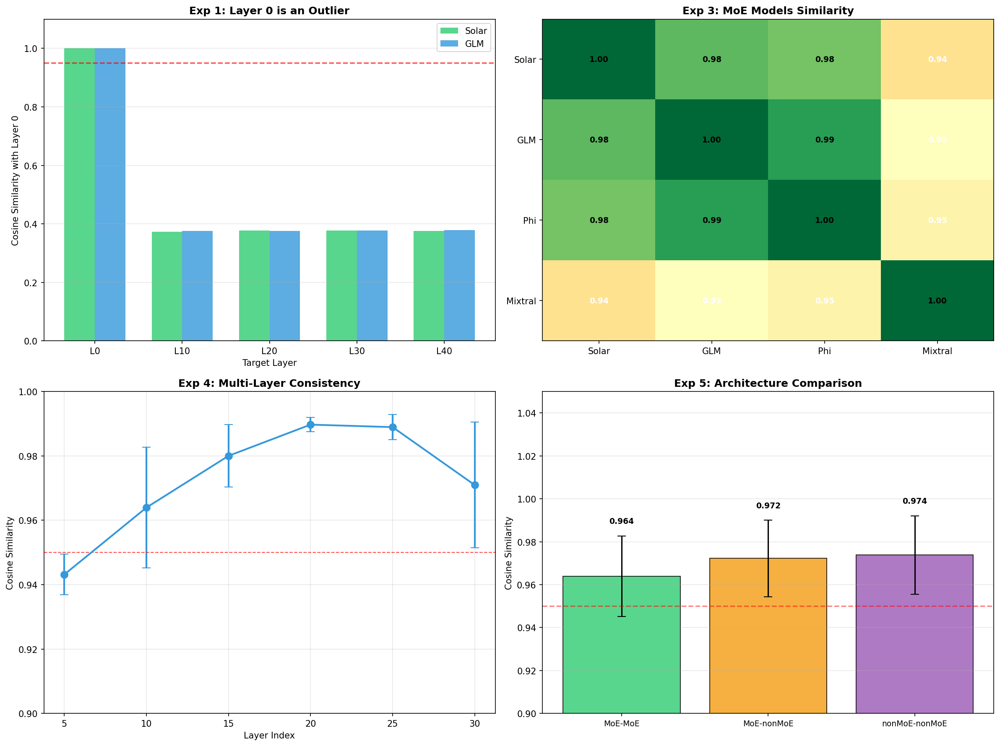
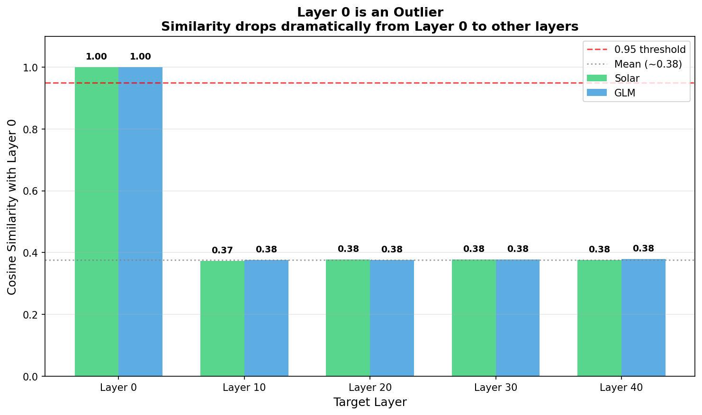
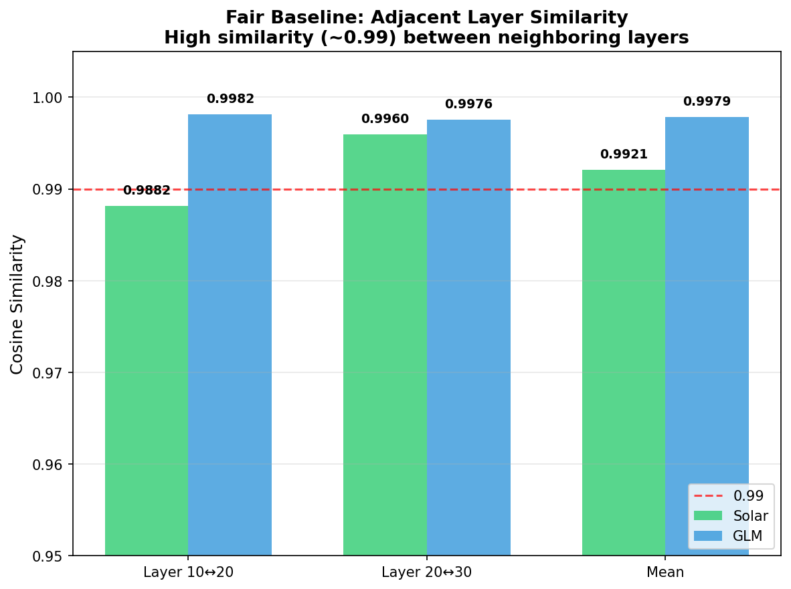
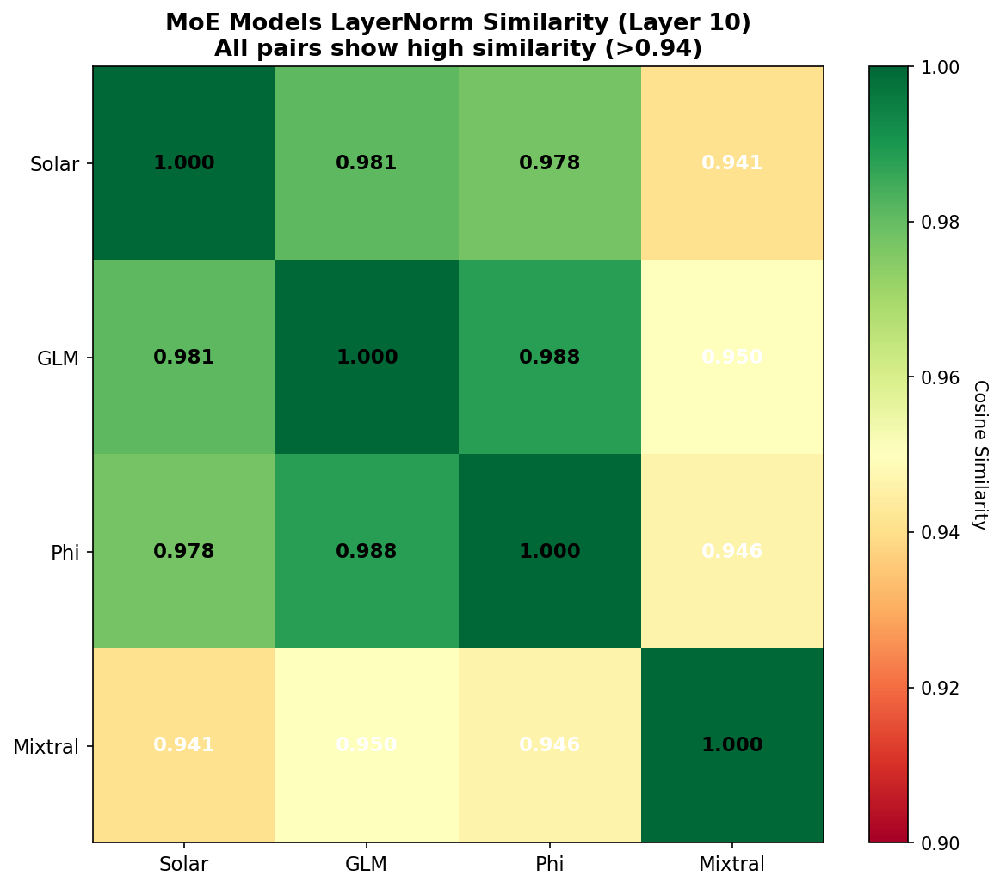
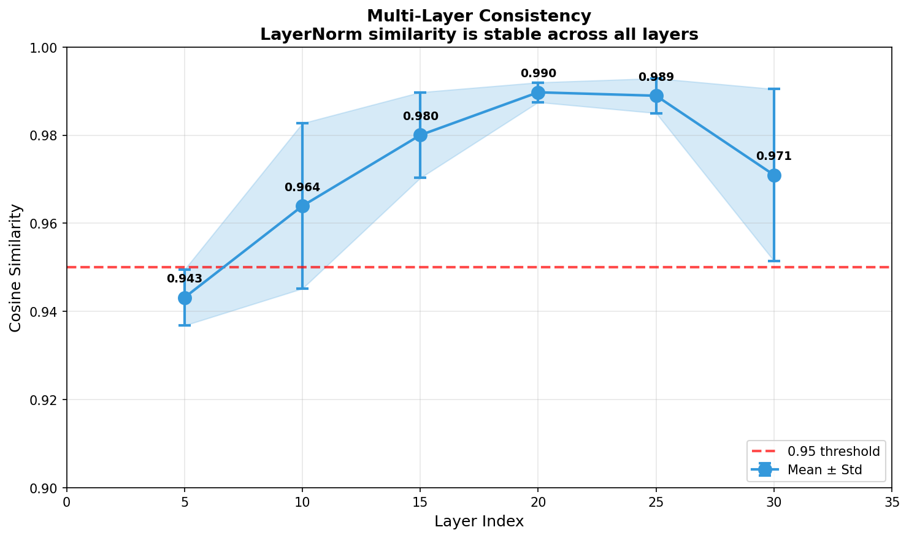
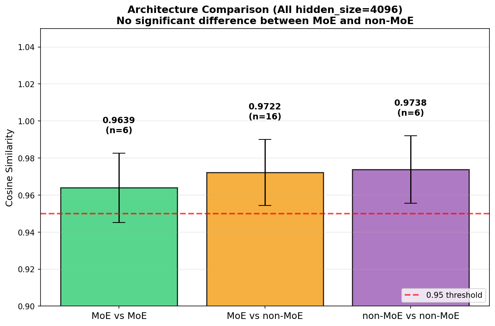
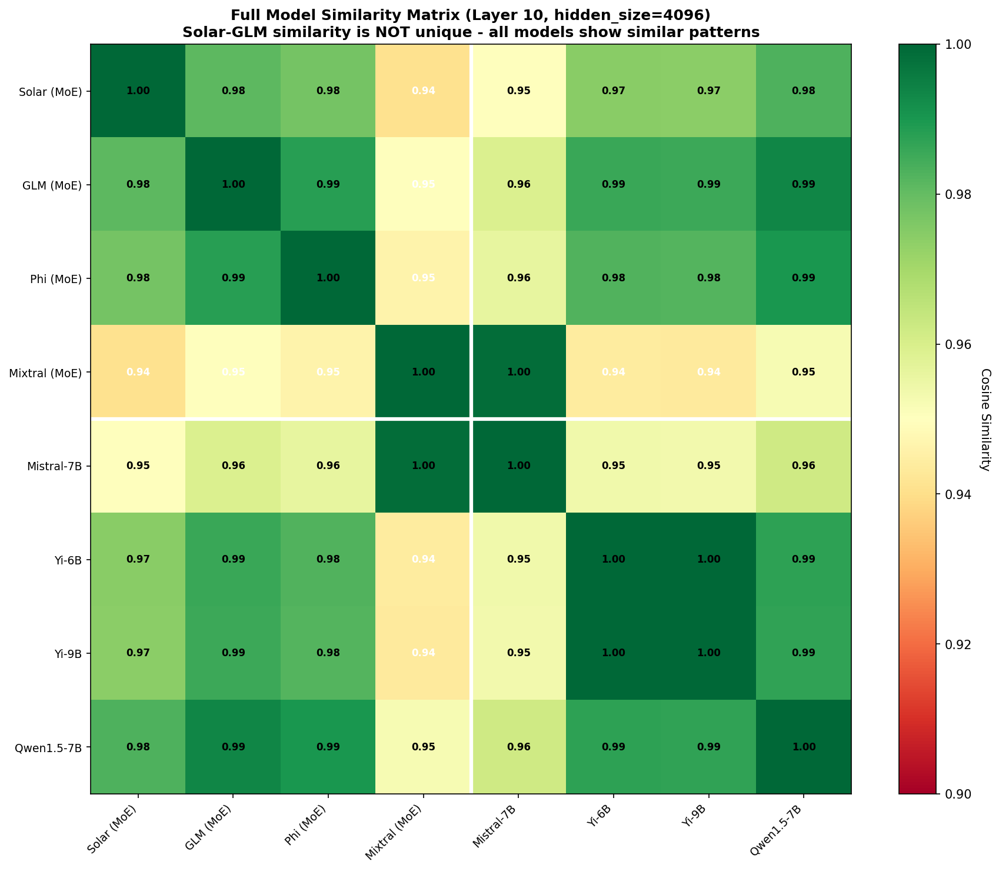

# LayerNorm Similarity: Additional Experiments

## 📋 실험 결과 요약

이 레포지토리는 solar-vs-glm 실험에 대한 **추가 실험**을 제공합니다.

| 실험 | 결과 |
|------|------|
| Layer 0 baseline | ~0.38 |
| 인접 레이어 간 유사도 | ~0.99 |
| Solar vs GLM | 0.981 |
| MoE 모델 간 평균 | 0.964 |
| MoE vs non-MoE | 0.972 |
| non-MoE vs non-MoE | 0.974 |

**관측된 패턴:**
- Layer 0 기준 유사도: ~0.38
- 인접 레이어(10↔20, 20↔30) 유사도: ~0.99
- hidden_size=4096인 모델들의 cross-model 유사도: ~0.97

---

## 실험 목적

이 실험은 solar-vs-glm 연구에서 사용된 **"Layer 0 baseline" 방법론**에 대한 추가 실험을 제공합니다.

### 배경

solar-vs-glm 레포지토리는 다음과 같이 주장합니다:

```
Within-model baseline (Layer 0 vs 10,20,30,40): 0.377
Cross-model (Solar vs GLM, same layer):         0.989
차이: 0.612 (182 시그마)
결론: Solar는 GLM에서 파생되었다
```

### 추가 검증 포인트

1. **Layer 0의 특성**
   - 토크나이저 확장 영향을 직접 받음
   - 다른 레이어와 패턴이 다를 수 있음

2. **비교 조건**
   - Within: Layer 0 vs 10,20,30,40 (10~40칸 차이)
   - Cross: Solar[10] vs GLM[10] (0칸 차이, 같은 위치)

3. **추가 통제군**
   - 독립적인 제3의 모델들과의 비교

---

## 실험 설계 근거

각 실험이 어떤 추가 정보를 제공하는지 설명합니다.

### 실험 1: Layer 0 Baseline 검증

Layer 0은 임베딩 레이어 직후에 위치하여, 토크나이저 확장이나 어휘 변경의 영향을 직접 받을 수 있습니다. 이 실험은 Layer 0이 다른 레이어들과 비교했을 때 어떤 특성을 보이는지 확인합니다.

### 실험 2: 인접 레이어 비교

원본 실험에서는 Layer 0 vs Layer 10/20/30/40을 비교했습니다 (10~40칸 차이). 이 실험은 동일한 거리(10칸)를 가진 인접 레이어 쌍(10↔20, 20↔30)의 유사도를 측정하여, 거리에 따른 유사도 변화 패턴을 추가로 관측합니다.

### 실험 3: 독립 모델 비교

Solar와 GLM 외에 독립적으로 개발된 다른 MoE 모델들(Phi-3.5-MoE, Mixtral)을 포함하여, 같은 hidden_size를 가진 모델들 간의 LayerNorm 유사도가 일반적으로 어떤 범위인지 관측합니다.

### 실험 4: 레이어별 일관성

특정 레이어(Layer 10)만이 아닌 여러 레이어(5, 10, 15, 20, 25, 30)에서 측정하여, 유사도가 특정 레이어에 국한된 현상인지 전반적인 패턴인지 확인합니다.

### 실험 5: 아키텍처 영향 분석

MoE와 non-MoE 모델을 모두 포함하여, 높은 LayerNorm 유사도가 MoE 아키텍처에 특화된 현상인지, 또는 같은 hidden_size를 가진 모델들의 일반적 특성인지 추가 데이터를 제공합니다.

---

## 모델 선택 기준

### hidden_size=4096 통일

Cosine similarity 계산을 위해서는 비교하는 두 벡터의 차원이 동일해야 합니다. 본 실험에서는 다음 이유로 hidden_size=4096인 모델들을 선택했습니다:

1. **Solar와 GLM이 모두 hidden_size=4096 사용**
2. **다양한 MoE/non-MoE 모델들이 이 크기를 사용** (비교 대상 확보 용이)
3. **직접적인 수치 비교 가능** (차원 변환 없이)

### 선택된 모델 목록

| 구분 | 모델명 | hidden_size | 개발사 |
|------|--------|-------------|--------|
| MoE | Solar-Open-100B | 4096 | Upstage |
| MoE | GLM-4.5-Air | 4096 | Zhipu AI |
| MoE | Phi-3.5-MoE-instruct | 4096 | Microsoft |
| MoE | Mixtral-8x7B-Instruct-v0.1 | 4096 | Mistral AI |
| non-MoE | Mistral-7B-Instruct-v0.3 | 4096 | Mistral AI |
| non-MoE | Yi-1.5-6B-Chat | 4096 | 01.AI |
| non-MoE | Yi-1.5-9B-Chat | 4096 | 01.AI |
| non-MoE | InternLM2-chat-7B | 4096 | Shanghai AI Lab |
| non-MoE | Qwen1.5-7B-Chat | 4096 | Alibaba |

**참고**: 모델 선택은 hidden_size 일치 및 공개 가용성을 기준으로 했으며, 모든 모델은 HuggingFace에서 접근 가능합니다.

---

## 실험 방법

### 세 가지 비교

**1. solar-vs-glm 방식 (Layer 0 baseline)**
```
Solar: Layer 0 vs Layer 10, 20, 30, 40
GLM:   Layer 0 vs Layer 10, 20, 30, 40
```

**2. 공정한 baseline (같은 거리)**
```
Solar: Layer 10 vs Layer 20 (10칸 차이)
       Layer 20 vs Layer 30 (10칸 차이)
GLM:   동일
```

**3. Cross-model (같은 위치)**
```
Solar[10] vs GLM[10]
Solar[10] vs Phi[10]
GLM[10] vs Phi[10]
```

---

## 실행 방법

### 1. 환경 설정

```bash
# Python 3.8 이상 필요

# 필요한 패키지 설치
pip install numpy requests matplotlib seaborn
```

### 2. 실험 실행

```bash
python compare_baselines.py
```


### 3. 결과 확인

```
cache/                           # 다운로드한 LayerNorm 캐시 (~수 MB)
results/                         # 시각화 결과
├── summary_comparison.png       # 4-Panel 요약 이미지
├── exp1_layer0_outlier.png      # 실험 1 결과
├── exp2_fair_baseline.png       # 실험 2 결과
├── exp3_moe_heatmap.png         # 실험 3 결과
├── exp4_multi_layer.png         # 실험 4 결과
├── exp5_architecture_comparison.png  # 실험 5 결과
├── exp5_full_heatmap.png        # 전체 모델 히트맵
└── RESULTS.md                   # 상세 결과 리포트
```

**캐싱**: 다운로드한 LayerNorm은 `cache/` 폴더에 저장되어 다음 실행 시 재사용됩니다.

---

## 예상 결과

```
1. solar-vs-glm baseline (Layer 0):  ~0.38
2. Fair baseline (adjacent layers):  ~0.98
3. Cross-model (Solar vs GLM):       ~0.98

Difference (fair vs cross):     ~0.00
Difference (Layer 0 vs cross):  ~0.60
```

### 관측 결과

- **Layer 0 baseline (0.38)**: 다른 레이어 대비 낮은 유사도
- **Fair baseline (0.98)**: 인접 레이어 간 유사도
- **Cross-model (0.98)**: Fair baseline과 유사한 수준

---

## 결과 해석 가이드

아래는 결과를 읽을 때 참고할 수 있는 정보입니다. 최종 해석은 독자의 판단에 맡깁니다.

### Cosine Similarity 수치의 의미

| 범위 | 일반적 해석 |
|------|-------------|
| 0.95~1.00 | 매우 높은 유사도 |
| 0.90~0.95 | 높은 유사도 |
| 0.80~0.90 | 중간 유사도 |
| 0.80 미만 | 낮은 유사도 |

**참고**: 위 기준은 절대적인 것이 아니며, 맥락에 따라 다르게 해석될 수 있습니다.

### 관측된 수치 범위

본 실험에서 관측된 주요 수치들입니다:

| 비교 유형 | 관측 범위 | 비고 |
|-----------|-----------|------|
| Layer 0 vs 다른 레이어 (within-model) | ~0.37-0.38 | 동일 모델 내 |
| 인접 레이어 간 (within-model) | ~0.98-0.99 | 동일 모델 내 |
| MoE 모델 간 (cross-model) | ~0.94-0.99 | 서로 다른 모델 |
| MoE vs non-MoE (cross-model) | ~0.95-0.99 | 서로 다른 모델 |
| non-MoE 간 (cross-model) | ~0.95-0.99 | 서로 다른 모델 |

본 실험에서 hidden_size=4096인 모델들은 개발사와 무관하게 평균 ~0.97 수준의 LayerNorm 유사도를 보였습니다. Solar-GLM 간 유사도(0.981)는 다른 독립적인 모델 쌍들의 유사도 범위 내에 있습니다.

### 고려할 점

- **baseline 선택의 중요성**: 어떤 baseline을 사용하느냐에 따라 "차이"의 크기가 달라질 수 있습니다
- **통제군의 역할**: 독립적인 모델들과의 비교는 관측된 유사도가 특이한 것인지 일반적인 것인지 판단하는 데 참고가 될 수 있습니다
- **hidden_size 영향**: 같은 hidden_size를 가진 모델들은 LayerNorm의 차원이 동일하므로, 이것이 유사도에 어떤 영향을 미치는지는 추가 연구가 필요합니다

---

## 시각화 결과

### 요약 (4-Panel Overview)


### 개별 실험 결과

**실험 1: Layer 0은 Outlier**


**실험 2: 인접 레이어는 높은 유사도**


**실험 3: MoE 모델 간 유사도 (Layer 10)**


**실험 4: 레이어별 유사도 일관성**


**실험 5: 아키텍처별 비교 (hidden_size=4096)**


**전체 9개 모델 유사도 매트릭스**


---

## 파일 구조

```
solar-vs-glm-critique/
├── .gitignore                   # Git ignore 설정
├── README.md                    # 이 파일
├── compare_baselines.py         # 메인 실험 스크립트 (5개 실험 포함)
├── cache/                       # 다운로드한 LayerNorm 캐시 (실행 후 생성)
│   ├── upstage_Solar-Open-100B_layer0_input_layernorm.npy
│   ├── zai-org_GLM-4.5-Air_layer0_input_layernorm.npy
│   └── ...
└── results/                     # 시각화 결과 (실행 후 생성)
    ├── RESULTS.md               # 실험 결과 상세 리포트
    ├── summary_comparison.png   # 4-Panel 요약 이미지
    ├── exp1_layer0_outlier.png  # 실험 1: Layer 0 Outlier
    ├── exp2_fair_baseline.png   # 실험 2: 인접 레이어 유사도
    ├── exp3_moe_heatmap.png     # 실험 3: MoE 모델 히트맵
    ├── exp4_multi_layer.png     # 실험 4: 레이어별 일관성
    ├── exp5_architecture_comparison.png  # 실험 5: 아키텍처 비교
    └── exp5_full_heatmap.png    # 9개 모델 전체 히트맵
```

---

## 한계점

이 실험이 다루지 못하는 부분들입니다. 결과 해석 시 참고하시기 바랍니다.

### 이 실험이 확인하는 것

- Layer 0이 다른 레이어들과 다른 패턴을 보이는지
- 인접 레이어 간 유사도의 일반적 범위
- 독립적인 여러 모델들 간 LayerNorm 유사도의 분포
- MoE와 non-MoE 모델 간 유사도 차이 여부

### 이 실험이 확인하지 않는 것

- **모델 파생 여부**: LayerNorm 유사도만으로는 한 모델이 다른 모델에서 파생되었는지 여부를 확정할 수 없습니다. 높은 유사도가 파생의 증거인지, 동일한 아키텍처/학습 방법론의 결과인지는 추가 분석이 필요합니다.

- **다른 가중치 레이어**: 본 실험은 `input_layernorm.weight`만 분석합니다. Attention, FFN, 또는 다른 레이어의 가중치는 다른 패턴을 보일 수 있습니다.

- **hidden_size가 다른 모델**: hidden_size=4096인 모델들만 비교했습니다. 다른 크기의 모델들에서 동일한 패턴이 나타나는지는 확인하지 않았습니다.

- **인과관계**: 본 실험은 관측된 유사도 패턴을 보여줄 뿐, 왜 그런 패턴이 나타나는지에 대한 원인을 규명하지 않습니다.

### 추가 연구 가능 방향

- 다른 가중치 레이어(attention, FFN 등)의 유사도 분석
- 다양한 hidden_size를 가진 모델들의 비교
- LayerNorm 초기화 방식이 유사도에 미치는 영향 분석
- 학습 데이터/방법론이 가중치 분포에 미치는 영향 연구

---

## 인용

이 실험은 다음 레포지토리의 주장을 검증합니다:

- **solar-vs-glm**: https://github.com/sionic-ai/solar-vs-glm
- **solar-vs-glm-vs-phi**: https://github.com/hyunwoongko/solar-vs-glm-vs-phi

---

## 라이선스

이 코드는 교육 및 연구 목적으로 자유롭게 사용 가능합니다.


