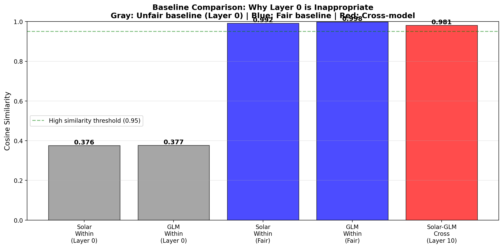
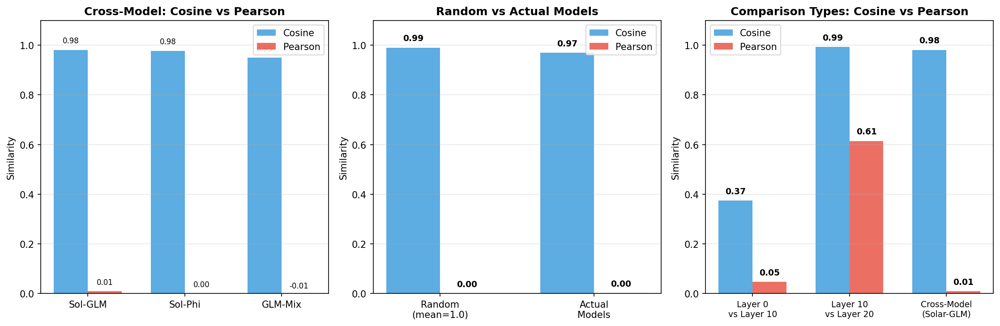

# LayerNorm 유사도 비교 실험 결과

> 생성일시: 2026-01-02 17:22:30

## 개요

Solar와 GLM 모델 간 LayerNorm 가중치 유사도를 다양한 조건에서 측정한 결과입니다.

---

## 실험 1: Layer 0 기준 유사도

Layer 0을 기준으로 다른 레이어들과의 유사도를 측정한 결과입니다.

| 모델 | Layer 0 vs 10 | Layer 0 vs 20 | Layer 0 vs 30 | Layer 0 vs 40 | 평균 |
|------|---------------|---------------|---------------|---------------|------|
| Solar | 0.3731 | 0.3773 | 0.3771 | 0.3761 | 0.3759 |
| GLM   | 0.3758 | 0.3757 | 0.3773 | 0.3790 | 0.3769 |

---

## 실험 2: 인접 레이어 간 유사도

동일한 거리(10 레이어)를 가진 인접 레이어 쌍의 유사도입니다.

| 모델 | Layer 10 vs 20 | Layer 20 vs 30 | 평균 |
|------|----------------|----------------|------|
| Solar | 0.9882 | 0.9960 | 0.9921 |
| GLM   | 0.9982 | 0.9976 | 0.9979 |

---

## 실험 3: MoE 모델 간 비교 (Layer 10)

4개의 MoE 모델에서 동일 레이어의 LayerNorm 유사도입니다.

| 모델 쌍 | Cosine 유사도 |
|---------|---------------|
| Solar vs GLM | 0.9811 |
| Solar vs Phi | 0.9776 |
| Solar vs Mixtral | 0.9408 |
| GLM vs Phi | 0.9881 |
| GLM vs Mixtral | 0.9497 |
| Phi vs Mixtral | 0.9465 |

- 평균: 0.9639
- 표준편차: 0.0187

---

## 실험 4: 레이어별 유사도 변화

여러 레이어(5, 10, 15, 20, 25, 30)에서 MoE 모델 간 유사도 추이입니다.

| Layer | 평균 유사도 | 표준편차 |
|-------|-------------|----------|
| 5 | 0.9432 | 0.0063 |
| 10 | 0.9639 | 0.0187 |
| 15 | 0.9800 | 0.0097 |
| 20 | 0.9897 | 0.0022 |
| 25 | 0.9889 | 0.0039 |
| 30 | 0.9710 | 0.0195 |

- 전체 비교 횟수: 36회
- 전체 평균: 0.9728
- 전체 표준편차: 0.0202
- 레이어별 평균의 표준편차: 0.0161

---

## 실험 5: 동일 hidden_size (4096) 비교

동일 hidden_size(4096)를 가진 MoE와 non-MoE 모델 간 유사도 비교입니다.

### 비교 결과

| 비교 유형 | 평균 유사도 | 표준편차 | 비교 횟수 |
|-----------|-------------|----------|-----------|
| MoE vs MoE | 0.9639 | 0.0187 | 6 |
| MoE vs non-MoE | 0.9722 | 0.0178 | 16 |
| non-MoE vs non-MoE | 0.9738 | 0.0183 | 6 |

**참고**: 모든 모델이 hidden_size=4096으로 동일하여 Cosine similarity 계산이 가능합니다.

---

## 실험 6: 메트릭 비교 (Cosine vs Pearson vs L2)

Cosine similarity만으로는 "방향" 유사도만 측정되어, 평균값(~1.0)의 영향을 받을 수 있습니다.
Pearson correlation(centered cosine)과 L2 distance를 추가로 측정하여 비교합니다.

### 6-1. 랜덤 Baseline

4096차원의 랜덤 벡터(mean=1.0, std=0.1)로 기대되는 유사도입니다:

| 메트릭 | 평균 | 표준편차 |
|--------|------|----------|
| Cosine | 0.9901 | 0.0002 |
| Pearson | 0.0007 | 0.0150 |
| L2 | 9.0468 | 0.0996 |

### 6-2. 모델 간 비교 (Layer 10)

| 모델 쌍 | Cosine | Pearson | L2 |
|---------|--------|---------|-----|
| Solar vs GLM | 0.9811 | 0.0092 | 17.1803 |
| Solar vs Phi | 0.9776 | 0.0006 | 6.4785 |
| GLM vs Mixtral | 0.9497 | -0.0057 | 75.2530 |

### 6-3. Within-model 비교 (Layer 10 vs 20)

| 모델 | Cosine | Pearson | L2 |
|------|--------|---------|-----|
| Solar | 0.9882 | 0.4567 | 6.0495 |
| GLM | 0.9982 | 0.7720 | 9.9148 |

### 6-4. Layer 0 비교 (Layer 0 vs 10)

| 모델 | Cosine | Pearson | L2 |
|------|--------|---------|-----|
| Solar | 0.3731 | 0.0418 | 14.5038 |
| GLM | 0.3758 | 0.0521 | 31.2930 |

### 해석

- **Cosine이 높고 Pearson도 높음**: 실제 패턴이 유사함
- **Cosine이 높고 Pearson이 낮음**: 평균값(~1.0) 때문에 Cosine이 높아진 것
- **Random baseline과 비교**: 실제 모델들의 유사도가 랜덤보다 유의미하게 높은지 확인

---

## 결과 요약

| 측정 항목 | 값 |
|-----------|-----|
| Layer 0 기준 유사도 (Solar) | 0.3759 |
| Layer 0 기준 유사도 (GLM) | 0.3769 |
| 인접 레이어 유사도 (Solar) | 0.9921 |
| 인접 레이어 유사도 (GLM) | 0.9979 |
| Solar vs GLM (Layer 10) Cosine | 0.9811 |
| Solar vs GLM (Layer 10) Pearson | 0.0092 |
| MoE 모델 간 평균 | 0.9639 |
| MoE vs non-MoE 평균 | 0.9722 |
| non-MoE vs non-MoE 평균 | 0.9738 |
| 레이어별 유사도 표준편차 | 0.0161 |
| Random Baseline Cosine | 0.9901 |
| Random Baseline Pearson | 0.0007 |

---

## 사용된 모델

### MoE 모델 (hidden_size=4096)
- Solar-Open-100B (Upstage)
- GLM-4.5-Air (Zhipu AI)
- Phi-3.5-MoE-instruct (Microsoft)
- Mixtral-8x7B-Instruct-v0.1 (Mistral AI)

### non-MoE 모델 (hidden_size=4096)
- Mistral-7B-Instruct-v0.3 (Mistral AI)
- Yi-1.5-6B-Chat (01.AI)
- Yi-1.5-9B-Chat (01.AI)
- InternLM2-chat-7B (Shanghai AI Lab)
- Qwen1.5-7B-Chat (Alibaba)

---

## 실험 환경

- 측정 대상: `input_layernorm.weight`
- 유사도 측정: Cosine Similarity
- 가중치 추출: HTTP Range Request (전체 모델 다운로드 없이 LayerNorm만 추출)
